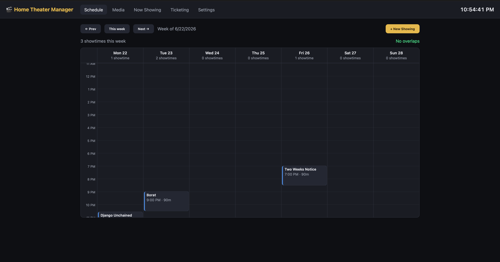
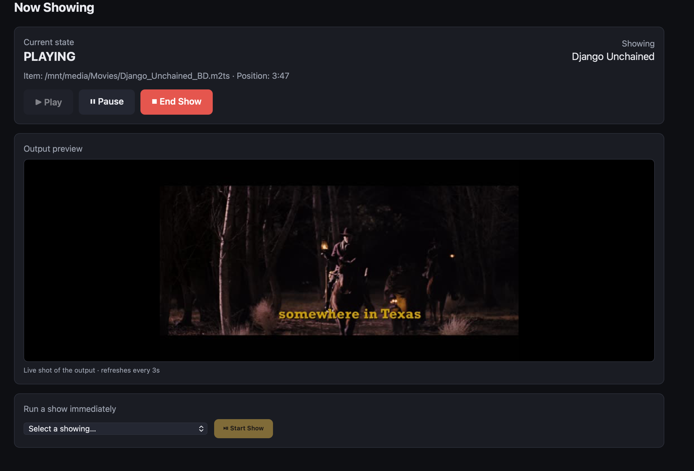
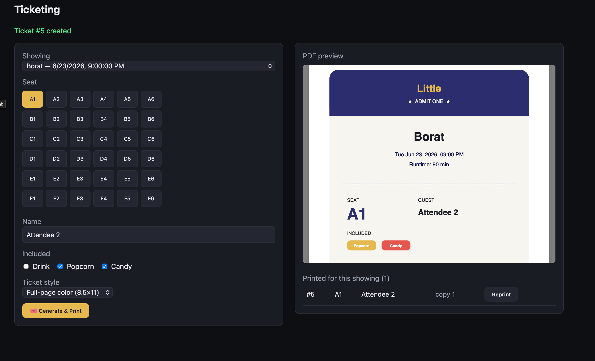
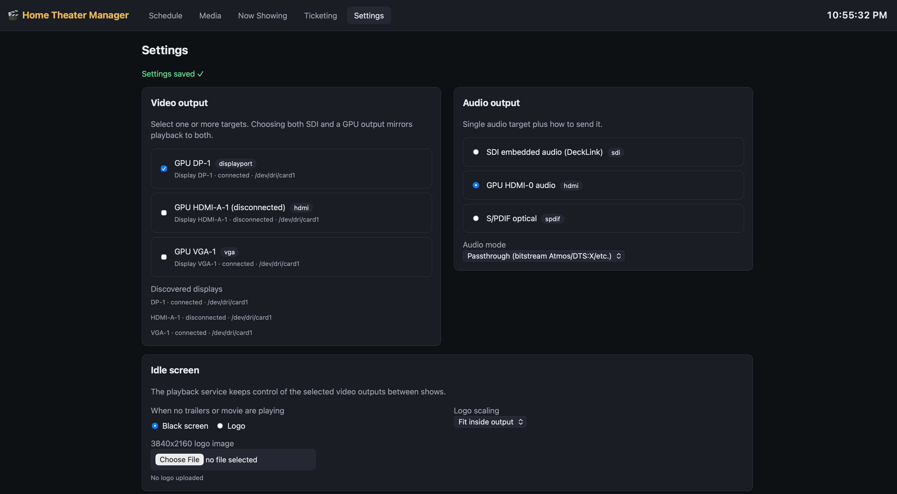
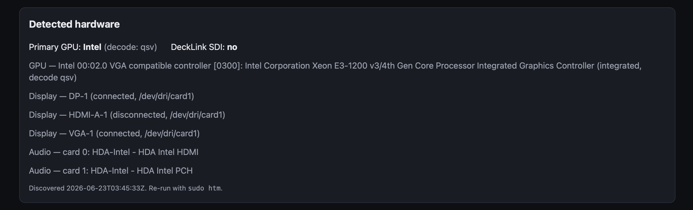

# 🎬 Home Theater Manager

Run your home cinema like a real movie theater: schedule showings, build
trailer + feature playlists, play them to a projector, and print novelty tickets
on an Epson thermal printer — all from a web UI on port 443.

> **Status: Phase 1+2/3 bridge.** The full web app, API, database, and default
> **mock** playback engine are runnable today. The playback service also has a
> real runner — **ffmpeg** for DeckLink/SDI and **mpv `--vo=drm`** for GPU/KMS
> connectors — that consumes the selected video/audio outputs and idle screen;
> GPU/SDI deployments still need on-hardware validation of the actual output —
> see [`ARCHITECTURE.md`](ARCHITECTURE.md).

---

## Quick start (Ubuntu Server or Rocky Linux)

One command installs Docker, fetches the app, runs a CLI setup wizard, and
starts everything:

```bash
curl -fsSL https://raw.githubusercontent.com/CALTechNet/home-theater-manager/main/deploy/install.sh | sudo bash
```

The wizard asks for your theater name, media location, seat grid,
and default ticket style, then builds and launches the stack. When it finishes
it prints the URL:

```
https://<server-ip>/
```

The certificate is self-signed by default, so your browser warns once — accept it.

### Non-interactive install

```bash
curl -fsSL https://raw.githubusercontent.com/CALTechNet/home-theater-manager/main/deploy/install.sh \
  | sudo HTM_MEDIA_HOST_PATH=/mnt/media HTM_THEATER_NAME="My Cinema" bash -s -- --non-interactive
```

`--no-tui` remains accepted as a backwards-compatible alias.

Supported targets: **Ubuntu Server 22.04/24.04** and **Rocky Linux 9/10**
(also Debian / RHEL / Alma via the same package families).

---

## Manual install (Docker Compose)

If you'd rather not use the installer:

```bash
git clone https://github.com/CALTechNet/home-theater-manager.git
cd home-theater-manager
cp .env.example .env
# edit .env — at minimum set HTM_MEDIA_HOST_PATH to your media mount
docker compose up -d --build
```

Then browse to `https://<server-ip>/`.

---

## Using it

The UI has five tabs:

1. **Schedule** — week view of all showings. Top-right **New Showing** opens the
   wizard (showtime → feature → trailers → review runtime → create). The feature
   step shows full movie info (aspect ratio, resolution, audio profile, runtime,
   size, bitrate). Click any showing to edit, delete, or jump to ticket printing.
2. **Media** — click **Scan library** to index files under your media mount.
   `ffprobe` reads duration, resolution, **aspect ratio**, codec, HDR, **audio
   format** (Atmos / DTS:X / PCM / 5.1 / 7.1 …), **file size**, and **bitrate**.
   Tag each file as a **feature** or **trailer**.
3. **Now Showing** — live playback state with **Play / Pause / End Show** shuttle
   controls, plus a "run a show immediately" selector.
4. **Ticketing** — pick a showing, choose a seat (e.g. `3C`), enter a name, tick
   **drink / popcorn / candy**, pick a **ticket style**, and generate. The server
   produces a **PDF** that opens in your browser's print dialog — print it to any
   printer your workstation can reach. Unlimited reprints with copy numbers.
   - **Thermal receipt** — 80mm roll layout
   - **Full-page color** — 8.5×11 portrait "movie ticket"
5. **Settings** — assign playback **video output(s)** (Blackmagic SDI, GPU
   HDMI/DisplayPort, or several at once to mirror) and the **audio output** +
   mode (passthrough for Atmos/DTS:X bitstreaming, or decode to PCM). Upload a
   **3840×2160 idle logo** or choose black screen so the playback service keeps
   the selected video outputs blank/logoed between trailers and movies. Also
   shows **detected hardware** from auto-discovery.

**First run:** open **Media → Scan library**, tag a feature and some trailers,
then create a showing from the **Schedule** tab.

---

## Screenshots

### Weekly schedule

Plan showtimes on a week calendar, spot overlaps, and jump into new showings or
ticket printing from one screen.



### Now showing

Monitor the active show, pause or end playback, preview the current output, and
start a scheduled showing immediately when needed.



### Ticketing

Pick the showing, seat, guest name, concessions, and ticket style, then preview
or reprint generated PDFs.



### Output settings

Choose discovered video displays and audio outputs, set passthrough/PCM mode,
and configure the idle screen used between shows.



### Detected hardware

Review what the installer discovered on the server, including GPU, display
connectors, and audio cards.



---

## Configuration (`.env`)

Generated by the installer; see [`.env.example`](.env.example) for all keys.

| Key | Purpose |
|---|---|
| `HTM_HTTPS_SITE_ADDRS` | HTTPS names/IPs Caddy should serve and include in its internal certificate |
| `HTM_TLS_DEFAULT_SNI` | Certificate name Caddy should use if a client opens the site by raw IP without SNI |
| `HTM_MEDIA_HOST_PATH` | Host path to your media (NFS/SMB mount), mounted read-only |
| `HTM_THEATER_NAME` | Name printed on tickets |
| `HTM_SEAT_MAX_ROW` / `HTM_SEAT_MAX_NUMBER` | Seat grid extents (e.g. `F` × `6` → 1A–6F) |
| `HTM_TICKET_STYLE` | Default ticket PDF style: `receipt` \| `fullpage` |
| `HTM_PLAYBACK_URL` | Playback control service (mock in Phase 1) |
| `HTM_PLAYBACK_DRIVER` | `mock` for demos, `ffmpeg` for the real ffmpeg runner |
| `HTM_HARDWARE_FILE` | Path to discovery output (default `/runtime/hardware.json`) |

After editing `.env`: `docker compose up -d` to apply.

### Media over the network

Mount your remote share on the host (don't stream over SFTP for playback), then
point `HTM_MEDIA_HOST_PATH` at it:

```bash
# NFS example
sudo mount -t nfs 10.0.0.5:/export/movies /mnt/media
# SMB example
sudo mount -t cifs //10.0.0.5/movies /mnt/media -o credentials=/root/.smbcreds
```

### Printing

Tickets are generated **server-side as PDFs** and printed from the **workstation
running the browser** — so they work with any printer that machine can reach
(network, USB, thermal, or a normal 8.5×11 color printer). The server itself has
no printer driver; its only outputs are the projector (SDI) and audio. Choose the
style per print in the Ticketing tab, or set the default with `HTM_TICKET_STYLE`.

### Real playback runner (ffmpeg + mpv)

The playback service defaults to `HTM_PLAYBACK_DRIVER=mock` so the app remains
demoable without hardware. Set `HTM_PLAYBACK_DRIVER=ffmpeg` for real playback
(the installer does this automatically when it detects a GPU render node or a
DeckLink card). The runner uses the Settings tab payload on every
`load`/`configure`:

- **Video outputs are auto-discovered** from the real DRM connectors in
  `runtime/hardware.json` (e.g. `gpu:DP-1`, `gpu:HDMI-A-1`, `gpu:VGA-1`), so the
  Settings list reflects the actual hardware. DeckLink/SDI is added when present.
- **Audio outputs are auto-discovered** from ALSA playback endpoints (e.g.
  `alsa:0,3` for HDMI or `alsa:2,0` for a USB interface), so newly attached
  HDMI/DP/USB/analog outputs can be selected in Settings after re-running
  discovery.
- **GPU/KMS connectors are driven by `mpv --vo=drm`** (targeting the connector +
  card node), so output works on modern systems that have no `/dev/fb0`.
  **DeckLink/SDI** continues to use ffmpeg. They can run side by side.
- `audio_output` is embedded into DeckLink/SDI when `sdi-embedded` is selected;
  for GPU outputs mpv plays audio through the selected ALSA device. You can pick
  an HDMI/DP ALSA endpoint that belongs to the same GPU interface as the video
  connector. `audio_mode=passthrough` bitstreams (mpv `--audio-spdif` / ffmpeg
  stream copy); `pcm` decodes.
- `idle_screen` shows either a **black screen** or the uploaded **3840×2160 logo**
  on the selected outputs whenever no trailer/feature is playing; the show plays
  when started.

**GPU output requires** (1) the playback container to have the GPU DRM nodes —
use the override `docker compose -f docker-compose.yml -f docker-compose.gpu.yml
up -d --build` (the installer wires this via `COMPOSE_FILE`), and (2) the
projector's connector freed from the Linux text console
(`deploy/console-routing.sh --video-output <CONNECTOR> --apply`, then reboot).

Exact host device targets can still be forced with JSON:

```bash
HTM_PLAYBACK_DRIVER=ffmpeg
HTM_DECKLINK_DEVICE='DeckLink Studio 4K'
HTM_VIDEO_OUTPUTS_JSON='[{"id":"decklink:0","name":"DeckLink Studio 4K","type":"sdi","embedded_audio":true,"ffmpeg_args":["-f","decklink","DeckLink Studio 4K"]}]'
HTM_AUDIO_OUTPUTS_JSON='[{"id":"hdmi-0","name":"AVR HDMI","type":"hdmi","ffmpeg_args":["-f","alsa","hw:0,3"]}]'
```

### Hardware discovery & the `htm` command

The installer auto-detects GPUs (**NVIDIA / AMD / Intel**, including integrated),
Blackmagic DeckLink cards, USB thermal printers, audio cards, and ALSA playback
outputs, writing `runtime/hardware.json` (shown in the Settings tab).

Re-run discovery or manage the stack any time with the CLI menu:

```bash
sudo htm
```

Menu options: **re-discover hardware** (after swapping a GPU/DeckLink/printer),
**console / video output routing**, install the DeckLink driver, set default
ticket style, status, logs, start/stop/restart, and update.

### Console vs. video output routing (VGA console access)

This is a server OS, so you'll often want to plug a monitor + keyboard into the
box for local admin. The trick is keeping the Linux **text console** off the
output that drives the **projector**:

- **DeckLink SDI playback** — nothing to do. SDI never touches the framebuffer,
  so every GPU connector is already free for the VGA console.
- **A GPU HDMI/DP connector drives the projector** — dedicate that connector to
  playback and keep the text console on another (e.g. the onboard VGA). The
  `console` entry in `sudo htm`, or `deploy/console-routing.sh` directly, writes
  a GRUB drop-in that disables the playback connector from the kernel console
  (`video=<conn>:d`) and pins the console where you want it.

```bash
# see connectors + serial ports, change nothing:
sudo bash deploy/console-routing.sh --list

# GPU HDMI drives the projector; keep the VGA text console; commit + reboot:
sudo bash deploy/console-routing.sh --video-output HDMI-A-1 --console-output VGA-1 --apply

# add a serial console (ttyS0) as a headless recovery fallback:
sudo bash deploy/console-routing.sh --video-output HDMI-A-1 --serial --apply

# undo HTM-managed console config:
sudo bash deploy/console-routing.sh --revert --apply
```

Without `--apply` the script only **previews** the kernel command line; nothing
is written. Changes take effect on the next reboot. Connector names come from
discovery (`runtime/hardware.json` → `connectors` / `serial`).

Applying also records the reservation to `runtime/console.json`, which the
**Settings tab** reads: a playback video output whose connector is claimed by
the console is badged *console-reserved* and warns if you select it (advisory —
it doesn't block, since output IDs become 1:1 with connector names in Phase 3).

### Blackmagic DeckLink (SDI) driver

When a DeckLink is detected, the installer offers to install the driver. It
**tries Blackmagic's CDN automatically** for a pinned Desktop Video version:

```
https://swr.cloud.blackmagicdesign.com/DesktopVideo/v<VER>/Blackmagic_Desktop_Video_Linux_<VER>.tar.gz
```

Blackmagic's CDN sometimes requires a **time-limited signed token** (the
`?verify=...` you see on links from their site). If the tokenless download is
refused, grab the link from
[blackmagicdesign.com/support](https://www.blackmagicdesign.com/support)
(Desktop Video → Linux) and pass it — or a local file:

```bash
# auto-download the pinned version (no token needed if the CDN allows it):
sudo bash deploy/install-decklink.sh --force

# pin a different version:
sudo HTM_DECKLINK_VERSION=16.0 bash deploy/install-decklink.sh --force

# paste a signed link from their site (ends with ?verify=...):
sudo HTM_DECKLINK_SRC='https://swr.cloud.blackmagicdesign.com/.../...tar.gz?verify=...' \
     bash deploy/install-decklink.sh --force

# or a local file / LAN URL:
sudo HTM_DECKLINK_SRC=/root/Blackmagic_Desktop_Video_Linux_16.0.tar.gz \
     bash deploy/install-decklink.sh --force
```

You can also do it from the `htm` menu → **Install DeckLink driver**. It installs
DKMS + kernel headers, builds and loads the kernel module, and verifies
`/dev/blackmagic*`. **A reboot may be needed** so DKMS can build against the
running kernel. (Advanced: `HTM_DECKLINK_DOWNLOAD_UUID` enables a best-effort
auto-resolve via Blackmagic's gated API.)

### TLS

Default is a self-signed cert (`tls internal` in `frontend/Caddyfile`). For a
real certificate, edit the Caddyfile to point at your cert/key or use ACME with
a domain, then rebuild the `frontend` image.

For self-signed/internal TLS, make sure `HTM_HTTPS_SITE_ADDRS` in `.env`
includes the exact IP address or hostname you open in the browser, then run
`docker compose up -d --build frontend`.

---

## Common commands

```bash
cd /opt/home-theater-manager      # installer's default location
docker compose ps                 # status
docker compose logs -f backend    # backend logs
docker compose restart backend    # restart a service
docker compose down               # stop everything
docker compose up -d --build      # rebuild + start after changes
```

---

## Development

```bash
# Backend
cd backend
python -m venv .venv && . .venv/bin/activate
pip install -r requirements-dev.txt
HTM_MEDIA_ROOT=/tmp uvicorn app.main:app --reload   # http://localhost:8000
pytest                                               # tests

# Frontend (proxies /api to localhost:8000)
cd frontend
npm install
npm run dev                                          # http://localhost:5173
```

---

## Repository layout

```
backend/        FastAPI app (API, scheduler, media scan, PDF tickets, migrations)
frontend/       React + Vite SPA, served by Caddy (TLS :443 + /api proxy)
playback-mock/  Stand-in playback control service (Phase 1)
deploy/         install.sh (installer), discover.sh (hardware), htm-menu.sh (CLI menu),
                console-routing.sh (VGA console vs. projector output / serial console)
runtime/        hardware discovery output (gitignored)
docker-compose.yml
ARCHITECTURE.md Design of record
```

See [`ARCHITECTURE.md`](ARCHITECTURE.md) for the full design, data model,
control API, HDR strategy, and the phased plan toward real hardware playback.
